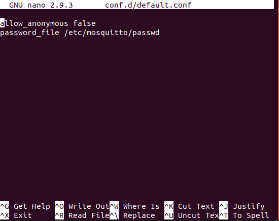

# EE250 Final Project - security-sys
## Team-Members
* None, worked solo

## Demo link
* ADD LINK

## External Libraries
1. Flask
2. Paho MQTT python module
3. Amazon AWS EC2 - for personal MQTT Broker

## Compilation / Pre-Requisites
1. Sensor node requirements
    * Paho MQTT client python module:
        + Instructions for Paho MQTT Client module installation, copied from EE250 Lab5 writeup:
            - We are specifically going to use the Python Paho-MQTT library. To be able to install any python packages, however, you will need to install `pip`. To specifically install the python3 version of pip, `pip3`, run the program with this command on both your VM and RPi.
            - `sudo apt install python3-pip`
            - Next, install `paho-mqtt` via `pip3` on both your VM and RPi: `pip3 install paho-mqtt`
    * GrovePi+ Starter Kit for RaspberryPi
        + With ultrasonic ranger connected to port __D6__, and the buzzer connected to port __D2__
            - **NOTE**: These sensors can be put in other ports, *BUT* you will have to edit the groveData class attributes as described on lines 5-11 in   src/dataLoader.py
        + **IMPORTANT**: You **MUST** change line 20 in dataLoader.py to the location of your GrovePi Python code. I left the aboslute path of my Grove code in and it will not work if you do not do this. 
        + You **MUST ALSO** change the ip address of the MQTT broker you will use on line 43 of src/dataLoader.py.
    
2. Control Node (VM/Host Machine)
    * Paho MQTT client python module:
        + Same instructions to install as describe in the previous section
    * Flask
        + In the terminal on your controll node run `sudo pip3 install flask python-dotenv`

## Important note about src/dataLoader.py
* There are up to four values that MUST change in this file in order to run the system properly:
    1. *Required Change*: IP Address & port of broker. 
        * The IP address for the MQTT broker (src/dataLoader.py line 37 & 38) must be updated to whatever broker IP and port number you are using. My AWS instance is not running continuously for financial reasons. So, change line 37 and line 38 to the IP and port for whichever MQTT Broker you use.
    2. *Required Change*: Add the absolute path of the GrovePi source code.
        * Edit the "grove_path" attribute on line 20 of src/dataLoader.py to the absolute path of the directory where your GrovePi python source code lives on your RPI.
    3. *Optional Change*: Address of the controller node running the http server.
        * If you're just running it on a local machine no need to change it. Otherwise, just put the IP and port in the "address" field on line 48 of src/dataLoader.py
    4. *Optional Change*: GrovePi sensor ports for the ultrasonic ranger or the buzzer.
        * If you plug the ultrasonic ranger into a port other than D6 or the buzzer into a port other than D2:
            + You MUST change values of "pin" on lines 25 and 31 respsectively.
## Program execution
**NOTE**: The required changes made in the section "Important Note about src/dataLoader.py" must be made IN src/dataLoader.py before running any of the following scripts. Both src/main.py and server/server.py rely on the values you edit in src/dataLoader.py.

1. Sensor Node (RPI)
    * **To run the sensor Node**: Once you have cloned into my repo and made the changes discussed above: On your RPI, cd into src and run `python3 main.py`. If everything is running properly, the sensor node will print that it has connected to the MQTT broker with status 0 and as the node runs it will print some statesments about what it is doing
2. Control Node (http server)
    * **To run the control node**: Again, once you have cloned into my repo and made the changes described above: In your VM (control node) cd into server and run `python3 server.py`.
    * **To use the control node**: After starting the server, go to the address the server is running on (default is http://localhost:5000/) and you will find my web interface for controlling the sensor node.
        + You can login to the webserver using the username "admin" and password "123".
        + Refer to the video demo at the top of the README for a run through of how the website is used. 

## MQTT Broker Setup - Using AWS EC2
These are the steps that I followed in setting up the MQTT broker that I used to create and test my project.
1. Launch an AWS instance, use the instructions provided in lab3 for creating and launching an AWS instance
    * Use the instructions provided [here](https://docs.aws.amazon.com/AWSEC2/latest/UserGuide/EC2_GetStarted.html) to create and AWS account.  
    * I created a t2.micro Ubuntu instance
    * The private key (.pem) file will be used to SSH into the AWS server **DO NOT LOSE IT**
        + If you're working in a linux environment, before you are able to use the .pem file, you need to change the permissions to '600', so run `sudo chmod 600 path_to_pem_file` 
    * **IMPORTANT NOTE**: the Security group for the instance must allow TCP connections on ports 1883
	  AND 9001 from any source. (More in-depth instructions [here](https://docs.aws.amazon.com/AWSEC2/latest/UserGuide/authorizing-access-to-an-instance.html))
    * You should be able to SSH into the instance following the instructions at [this link](https://docs.aws.amazon.com/AWSEC2/latest/UserGuide/AccessingInstancesLinux.html)
        + Use the command `ssh -i path_to_pem user@your_instance_public_IPv4`
            - Note: the default user for ubuntu is 'ubuntu' and for linux, the default user is 'ec2-user'
2. Install MQTT on AWS
    * SSH into your AWS instance as described above 
    * In the AWS instance terminal do the following:
        + `sudo apt-get update`
        + `sudo apt-get install mosquitto mosquitto-clients`
    * Optional MQTT Broker configurations:
        + If we want to password protect our connection to the broker we need to create some config files:
            - `cd /etc/mosquitto/conf.d`
            - `sudo nano default.conf`
            - This is what the default.conf file should contain:
            - 
        + Next we need to create a password file to store usernames and passwords
            - In the directory `/etc/mosquitto/conf.d` run the command `sudo mosquitto_passwd -c /etc/mosquitto/passwd username`
                * **Note:** there is more than one way to create/add users and passwords. Described [here](http://www.steves-internet-guide.com/mqtt-username-password-example/)
            - This command will then ask you to enter and then re-enter your password
        + The server is now password protected, so just restart your mqtt broker by running the command `sudo systemctl restart mosquitto.service`
3. To run the MQTT broker:
    * Make sure you are SSH'd into the AWS instance with MQTT installed as above; to start the MQTT broker with the configuration file you made, run the following command: `mosquito -c /etc/mosquitto/default.conf`
        - To run the MQTT broker with the default config (no password protections) just run `mosquitto`
        - For list of commands to run the broker run `mosquitto -h` 

